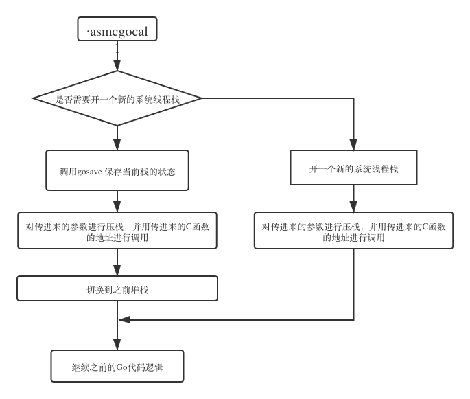

# Cgo： Go调用C
很多语言都提供了和C的互通，比如Lua自带了与C的扩展，Python也提供了C支持来解决性能问题，Java的JNI在Android的使用提供了Linux（Android）
的Native支持。Go作为C同父异母的兄弟（Ken Thompson 是Go和C的发明人之一，C是在AT&T的贝尔实验室，Go是在Google）。自然也是会支持和C互通
的。一个最“名正言顺”的使用C的理由就是：某些功能已经有C的实现，如果重写，需要实现+测试等等，而使用Cgo直接调用C的实现，则可以直接使用。

如果大家在查询Cgo的资料的时候，可能还会发现gccgo。gccgo是基于gcc的编译后端实现了Golang的[spec](http://docs.golang.org/ref/spec)。
一种实现，而我们平时默认的go命令则是另一套用Golang实现的叫gc的实现。

## 1. Go里面调用C
先来看一个Go调用C的例子：

	package main
	
	import (
		"fmt"
	)
	
	/*
	#include <stdlib.h>
	*/
	import "C"
	
	func Random() int {
		return int(C.random())
	}
	
	func main() {
		i := Random()
		fmt.Printf("i is %v \n", i)
	}

执行"go build"后运行程序：

	cz$ go build -o cgodemo
	cz$ ./cgodemo
	i is 1804289383
	
这样就实现了从Golang里面调用了C标准库stdlib中的random函数。

## 2. 插入C代码
在Golang的代码里面增加一个单独`import "C"`,注意是单独，不能和其他import 混在一起。然后在这一行之上的经挨着的注释块里面，
可以添加C代码，比如这里引入了"<stdlib.h>"文件。如果是自己实现的C函数也可以直接写在这里，比如：

	package main
	
	import (
		"unsafe"
	)

	//	
	// #include <stdio.h>
	//
	// void dump(void *ptr, int len) {
	//  char *p = (char *)ptr;
	// 	printf("dump:\n");
	//  for(int i=0; i< len; i++) {
	//      printf("    [%d]:%c \n", i, p[i]);
	//  }
	// }
	//
	//
	import "C"
	
	func main() {
		s := "abc"
	
		p := []byte(s)
		C.dump(unsafe.Pointer(&p[0]), C.int(len(p)))
	}
	
执行构建后运行：

	cz$ go build
	CHANGZENG-MB0:cgodemo cz$ ./cgodemo
	dump:
	    [0]:a
	    [1]:b
	    [2]:c	
	    
这里将一个字符数组传递到C函数中，并按照字符位置逐个打印。	    

## 3. 参数传递
在上面的例子中，当给`void dump(void *ptr, int len) `函数传递参数时，对于 "void *" 使用了"unsfae.Pointer",而"int"
则用了"C.int"。

当Go中调用C的时候，相应的参数类型需要作一个转换：

|Cgo的类型|C的类型|
|---|---|
|C.char| char|
|C.schar| signed char|
|C.uchar|unsigned char| 
|C.short| short|
|C.ushort| unsigned short|
|C.int| int|
|C.uint| unsigned int|
|C.long|long|
|C.ulong| unsigned long|
|C.longlong| long long|
|C.ulonglong | unsigned long long|
|C.float| float|
|C.double| double|

而对于一般指针则使用"unsafe.Pointer"，而数组需要使用"unsafe.Pointer(&p[0])"这样，取第一个元素的地址做转换。

这里特殊的一个就是String，因为C里面没有string，所以当将String传递给C的时候要这样：

	package print
	
	// #include <stdio.h>
	// #include <stdlib.h>
	import "C"
	import "unsafe"
	
	func Print(s string) {
	    cs := C.CString(s)
	    C.fputs(cs, (*C.FILE)(C.stdout))
	    C.free(unsafe.Pointer(cs))
	}
	
用`C.CString`将String转换成C的string，因为这个转换会触发C里面分配内存，所以最后还要调用`C.free`将该内存进行释放。

## 4. 编译过程

从代码上看，使用Cgo有个明显的标记是`import "C"`，然后从这行往上的注释代码。那么"go"命令是如何处理的呢？
其实"go"是通过调用"cgo"命令：`go tool cgo`来实现的。

"cgo"命令会将上面的`import "C"`之上的C代码扣出来，形成一个单独的C文件,而其他的Go文件形成一个单独的文件。

这里我们运行

	go tool cgo main.go
	
会发现当前目录下增加了一个"_obj"	目录，里面是预处理后生成的.c和.go文件以及预处理后的.o目标文件。

	_obj cz$ tree .
	.
	├── _cgo_.o
	├── _cgo_export.c
	├── _cgo_export.h
	├── _cgo_flags
	├── _cgo_gotypes.go
	├── _cgo_main.c
	├── main.cgo1.go
	└── main.cgo2.c
	
在编译C的过程中，需要传递编译参数时，通过`// #cgo` 来实现，比如：

	// #cgo LDFLAGS: -L/go/src/foo/libs -lfoo
	
来设置LDFLAGS，将这个注释放在 `#import "C"` 之上的C代码的注释的开头。还可以设置的有类似
"CFLAGS, CPPFLAGS, CXXFLAGS, FFLAGS, LDFLAGS "。
	
## 5. runtime的实现	
	
上面的"main.cgo1.go"	就是上面说的剥离了C代码后的Go代码：

	// Code generated by cmd/cgo; DO NOT EDIT.
	
	//line main.go:1:1
	package main
	
	import (
		"unsafe"
	)
	
	import _ "unsafe"
	
	func main() {
		s := "abc"
	
		p := []byte(s)
		func() { _cgoIndex0 := &/*line :24:25*/p; _cgo0 := /*line :24:9*/unsafe.Pointer(&(*_cgoIndex0)[0]); var _cgo1 _Ctype_int = _Ctype_int(len(p)); _cgoCheckPointer(_cgo0, *_cgoIndex0); _Cfunc_dump(_cgo0, _cgo1); }()
	}
	
基本上就是原来Go代码的逻辑，而对C的调用则是:

	 _Cfunc_dump(_cgo0, _cgo1)
	 
这个函数是在"_cgo_gotypes.go" 中定义的：

	//go:cgo_unsafe_args
	func _Cfunc_dump(p0 unsafe.Pointer, p1 _Ctype_int) (r1 _Ctype_void) {
		_cgo_runtime_cgocall(_cgo_67fbe5e68a3c_Cfunc_dump, uintptr(unsafe.Pointer(&p0)))
		if _Cgo_always_false {
			_Cgo_use(p0)
			_Cgo_use(p1)
		}
		return
	}
	
同时这个文件还定义了：

	type _Ctype_int int32	

这些上面参数阶段介绍的"C.int"等的定义。
	
这里通过runtime的cgo机制调用了C定义的函数：

	_cgo_runtime_cgocall(_cgo_67fbe5e68a3c_Cfunc_dump, uintptr(unsafe.Pointer(&p0)))

也就是调用C函数`_cgo_67fbe5e68a3c_Cfunc_dump`并传递参数 `uintptr(unsafe.Pointer(&p0))`。 而这个C函数则是有上面cgo工具分割出来的，
在"main.cgo2.c"文件中：

	CGO_NO_SANITIZE_THREAD
	void
	_cgo_67fbe5e68a3c_Cfunc_dump(void *v)
	{
		struct {
			void* p0;
			int p1;
			char __pad12[4];
		} __attribute__((__packed__)) *_cgo_a = v;
		_cgo_tsan_acquire();
		dump(_cgo_a->p0, _cgo_a->p1);
		_cgo_tsan_release();
	}	
	
再来回头看上面	_cgo_runtime_cgocall ，该函数的定义为：

	//go:linkname _cgo_runtime_cgocall runtime.cgocall
 	func _cgo_runtime_cgocall(unsafe.Pointer, uintptr) int32

其实是在"_cgo_gotypes.go" 	文件中声明的，这里链接的这个函数是在runtime的代码中定义，

这里转到Golang的源码：src/runtime/cgocall.go

	// Call from Go to C.
	//go:nosplit
	func cgocall(fn, arg unsafe.Pointer) int32 {
		if !iscgo && GOOS != "solaris" && GOOS != "illumos" && GOOS != "windows" {
			throw("cgocall unavailable")
		}
	
		if fn == nil {
			throw("cgocall nil")
		}
	
		if raceenabled {
			racereleasemerge(unsafe.Pointer(&racecgosync))
		}
	
		mp := getg().m
		mp.ncgocall++
		mp.ncgo++
	
		// Reset traceback.
		mp.cgoCallers[0] = 0
	
		entersyscall()
	
		mp.incgo = true
		errno := asmcgocall(fn, arg)
	  ...
	  
这里最后调用了汇编函数`asmcgocall`，这里以amd64汇编为例，在文件：src/runtime/asm_amd64.s中：

	// func asmcgocall(fn, arg unsafe.Pointer) int32
	// Call fn(arg) on the scheduler stack,
	// aligned appropriately for the gcc ABI.
	// See cgocall.go for more details.
	TEXT ·asmcgocall(SB),NOSPLIT,$0-20
		MOVQ	fn+0(FP), AX
		MOVQ	arg+8(FP), BX
		...
		RET
		
汇编的内容比较长，不同的平台也有不相同，大致意思是切换到调用堆栈，然后在将要调用C函数的函数指针地址loading进寄存器，
并构建堆栈，将参数压栈，然后在通过"CALL"命令执行对应的函数。然后在CALL之后在切换到当前的Golang执行的上下文。

	 
这样就完成了从Go的上下文调用一个C函数再返回到Go的上下文中。	 

从这里也可以发现一些使用Cgo的问题，就好比OC里面OC和C的混编使得ARC失效，而这里因为是从汇编层面直接裸调用了C代码生成的汇编，
所以Golang的runtime带来的特性也就没有了：

* 自动内存管理，GC特性
* 跨平台支持
* 交叉编译
* ...

	 	

## 总结
上面说的"名正言顺"使用Cgo复用C模块的理由，在很久以前，可能是非常政治正确的。但是到了现在（2018），很多功能模块基本都有了Golang的实现了，
是否还需要使用Cgo，则需要考虑一下。而使用了CGo的话，可能就会失去一些Go的特性，所以在什么场合下使用，是使用者需要考虑的。同时，使用Cgo最需要
考虑的是指针关系，要搞清楚是C指针还是Go指针所指向的内存。是否需要我们手动释放内存，避免使用错误导致的崩溃和内存泄漏。

## 参考
1. [Command cgo](http://docs.golang.org/cmd/cgo/)
2. [C? Go? Cgo!](https://blog.golang.org/c-go-cgo)
3. [src:runtime/cgocall.go](https://github.com/golang/go/blob/master/src/runtime/cgocall.go)
