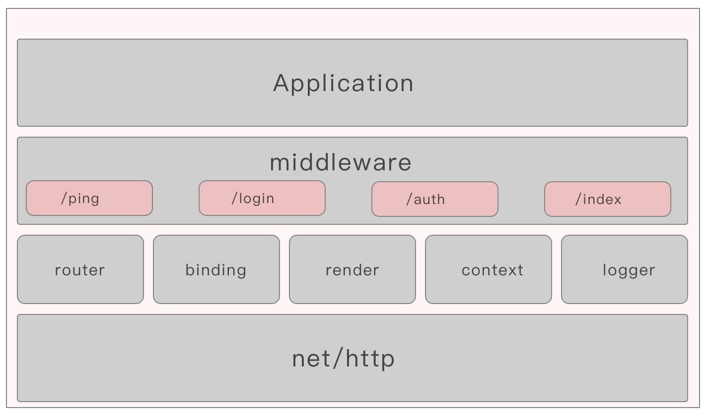
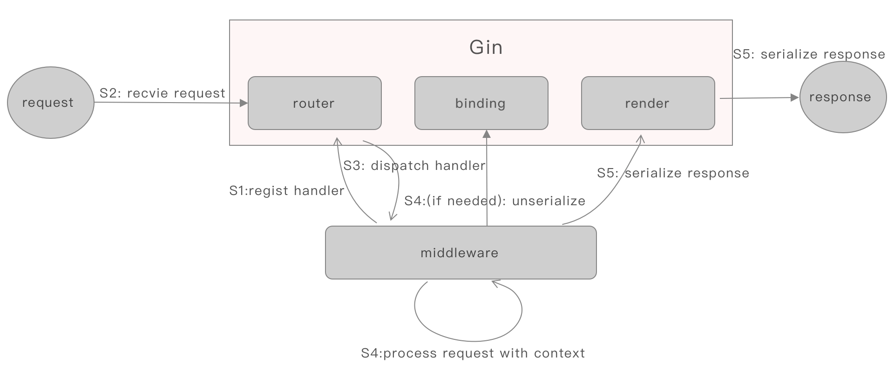

# Gin是个怎样的框架

> **What is Gin?** Gin is a web framework written in Golang. It features a martini-like API with much better performance, up to 40 times faster. If you need performance and good productivity, you will love Gin.
>

在Gin的[官网](https://gin-gonic.com/)上对Gin是如此描述的，而在其[Github](https://github.com/gin-gonic/gin)上
的描述则为：

> Gin is a web framework written in Go (Golang). It features a martini-like API with performance that is up to 40 times faster thanks to httprouter. If you need performance and good productivity, you will love Gin.
> 

所以从Gin自己的介绍来看，Gin就是一个用Golang写的Web框架。其接口设计与另一个Golang的Web框架[martini](https://github.com/go-martini/martini)
类似，然后性能还是特别好。就是一个Golang的性能比较好的Web框架。

那么又来另外一个问题了。何为Web框架？如果是Python，那必将引来一阵"XXX是最好的框架"，或者是"半个小时实现一个你的框架"等讨论，而Golang的标准库
就提供了"net/http"模块，用来处理web服务，用这个模块就可以实现web服务编程，比如写个RESTFul接口，就是分分钟的事情。那么这"net/http"算不算一个web框架呢？

所谓框架，并没有一个特别准确的定义，我认为可以把一系列的基本功能模块放在一起，组合成一个大的独立的功能，就可以认为这整个组合算是一个框架。

那么Gin包含了哪些基础模块呢？

## 1. Gin的组成
Gin框架的应用从上大小大概可以分成这样几层：

最下面的是"net/http"，这个是标准库提供的web服务器层，用来接收和处理HTTP请求的部分,这块也可以替换成另外一个社区产品：
["fasthttp"](https://github.com/valyala/fasthttp)。这一层相当于网络接受层。

在其上的就是Gin提供的基础功能模块了，比如：

* 请求路由的router
* 封装了请求的context
* 做请求反序列化的binding
* 做响应序列化的render
* 负责日志打印的logger

再上面就是业务自己实现的各种middleware，也就是针对不同的请求路径实现的响应的handler。

多个middleware就组成了开发者的一个具体应用，比如账号服务、支付服务等。

在最近发布的[Gin 1.5.0](https://github.com/gin-gonic/gin/releases/tag/v1.5.0)中，"path.go"、"routergroup.go"和"tree.go"对应了
router模块， "binding"对应源码目录中的binding目录；"render"目录对应了render模块；"context.go"对应了context模块，"logger.go"对应了logger模块。

## 2. Gin的Workflow
先来看个例子：

	package main
	
	import "github.com/gin-gonic/gin"
	
	func main() {
		r := gin.Default()
		r.GET("/ping", func(c *gin.Context) {
			c.JSON(200, gin.H{
				"message": "pong",
			})
		})
		r.GET("/hello/:name", func(c *gin.Context) {
			name := c.Param("name")
			c.String(http.StatusOK, "Hello %s", name)
		})
		
		r.Run() // listen and serve on 0.0.0.0:8080 (for windows "localhost:8080")
	}

执行运行后，在浏览器里面访问"http://127.0.0.1:8080/ping"后得到：

	{"message":"pong"}
	
结果为一个JSON格式，而访问"http://127.0.0.1:8080/hello/cz"后得到：

	Hello cz

那么这个请求处理过程是怎样的呢？

gin.Default产生一个Gin的Engine对象，该对象实现了net/http.Handler 接口,在gin.go中有Engine的定义和接口实现:

	// Engine is the framework's instance, it contains the muxer, middleware and configuration settings.
	// Create an instance of Engine, by using New() or Default()
	type Engine struct {
		RouterGrou
		...
	}
		
	// ServeHTTP conforms to the http.Handler interface.
	func (engine *Engine) ServeHTTP(w http.ResponseWriter, req *http.Request) {
		...
	}

Gin的router是对[httprouter](https://github.com/julienschmidt/httprouter)的改进,本质是一棵根据路径构建的Radix Tree，
业务代码中的GET方法注册了"/ping"和"/hello/:name"的处理handler到这棵Radix Tree上，产生的作用就有点类似一个Map保存了路径和
对应处理Handler的键值对，但是效率更高。

当调用Engine的`Run()`方法时：

	// Run attaches the router to a http.Server and starts listening and serving HTTP requests.
	// It is a shortcut for http.ListenAndServe(addr, router)
	// Note: this method will block the calling goroutine indefinitely unless an error happens.
	func (engine *Engine) Run(addr ...string) (err error) {
		...
		address := resolveAddress(addr)
		err = http.ListenAndServe(address, engine)
		return
	}

实际上就是开启一个net/http.server来处理http请求，传入的handler就是上面的Default的Engine。

然后当有客户端发送HTTP请求时，net/http通过TCP连接接受数据并做HTTP解析后，回调上面实现的ServeHTTP：

	// ServeHTTP conforms to the http.Handler interface.
	func (engine *Engine) ServeHTTP(w http.ResponseWriter, req *http.Request) {
		c := engine.pool.Get().(*Context)
		c.writermem.reset(w)
		c.Request = req
		c.reset()
	
		engine.handleHTTPRequest(c)
		engine.pool.Put(c)
	}

这里通过context包装一个请求的	http.Request，然后进行处理：

	func (engine *Engine) handleHTTPRequest(c *Context) {
		httpMethod := c.Request.Method
		...
		t := engine.trees
		for i, tl := 0, len(t); i < tl; i++ {
			if t[i].method != httpMethod {
				continue
			}
			root := t[i].root
			// Find route in tree
			value := root.getValue(rPath, c.Params, unescape)
			if value.handlers != nil {
				...
				c.Next()
			}
			...
		}
		...
	}	
	
通过请求中的路径，从对应的router的RadixTree中搜寻对应的处理handler，同时将路径中的参数进行解析：

	// Next should be used only inside middleware.
	// It executes the pending handlers in the chain inside the calling handler.
	// See example in GitHub.
	func (c *Context) Next() {
		c.index++
		for c.index < int8(len(c.handlers)) {
			c.handlers[c.index](c)
			c.index++
		}
	}			

在找到后，Next方法会触发注册的handlers函数调用。

在前面的例子中，通过：

	name := c.Param("name")			
获取了路径中解析的"name"参数对应的值，然后通过：

	c.JSON(200, gin.H{
				"message": "pong",
			})
	})
	...
	c.String(http.StatusOK, "Hello %s", name)

将结果序列成JSON或者普通的字符串,其本质是调用各个格式的Render函数，比如JSON中是：

	// Render (JSON) writes data with custom ContentType.
	func (r JSON) Render(w http.ResponseWriter) (err error) {
		if err = WriteJSON(w, r.Data); err != nil {
			panic(err)
		}
		return
	}
	
	// WriteJSON marshals the given interface object and writes it with custom ContentType.
	func WriteJSON(w http.ResponseWriter, obj interface{}) error {
		writeContentType(w, jsonContentType)
		encoder := json.NewEncoder(w)
		err := encoder.Encode(&obj)
		return err
	}	

调用了Gin自带的JSON库，进行了序列化并写回给net/http.ResponseWriter,从而传递给客户端。

而对于String是：

	// Render (String) writes data with custom ContentType.
	func (r String) Render(w http.ResponseWriter) error {
		return WriteString(w, r.Format, r.Data)
	}
	
	// WriteString writes data according to its format and write custom ContentType.
	func WriteString(w http.ResponseWriter, format string, data []interface{}) (err error) {
		writeContentType(w, plainContentType)
		if len(data) > 0 {
			_, err = fmt.Fprintf(w, format, data...)
			return
		}
		_, err = io.WriteString(w, format)
		return
	}
	
直接将string内容写回给客户端。	

## 3. 总结
Gin作为一个高性能的Golang实现的Web框架，其实就是在标准库的net/http基础上增加了一个高性能且包含路径参数解析的router，
和一个请求body参数反序列化模块，然后用context封装了一套操作的API给业务使用，最后提供了JSON/XML/YAML等序列化功能写回
给net/http.ResponseWriter模块的模块集合。

如果那Python来对比的话，可以认为net/http是Tornado的tcpserver.py或者Flask依赖的Werkzeug(WSGI)，进行TCP的数据接受
并按照HTTP协议进行解析。解析后的数据根据路径通过路由进行解析，找到预先注册好的处理函数，而其他模块就是最基本的JSON、XML、YAML
等等格式的序列化和反序列化。这样就构成了一个Web请求处理的：数据接受-》 数据解析-》数据处理-》 数据序列化-》数据发送 这样一套
最基本的流程。所以现在Gin得到大家追评的一个原因就是他如果Python的Flask、Tornado一样，结构简单，可定制性好。

## 参考
1. [Gin v1.5.0](https://github.com/gin-gonic/gin/releases/tag/v1.5.0)
2. [net/http ServeMux](https://golang.org/pkg/net/http/#ServeMux)
3. [fasthttp-routing](https://github.com/qiangxue/fasthttp-routing)
