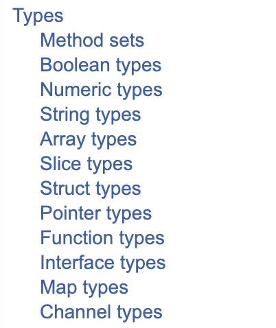

# First-Class Functions in Go

在Golang的[Language Spec](https://docs.golang.org/ref/spec)中的目录中是这样分类的：

其中将"Function"分列在“Types”的分类中，也就是说，在Golang中，函数是和字符串、
数组、指针等一样为一等公民，也就是所谓的“First-Class”类型。既然是类型的一种
，所以就可以将它和数字、字符串一样赋值给变量，同样的也可以将其作为参数传递给
函数或者其他变量甚至作为函数的返回值。

## 1. 函数类型的使用
上面说了，在Golang的定义中，就将函数类型和普通类型划分成一类类型。也就是说Golang是支持
“First-Class Functions”的。具体到Golang中，则有：

* Anonymous functions
* User-defined function
* Higher-order functions
* Closures

其中，虽然将“Closures”单列出来，实际上其也是“Anonymous functions”的中一种，只是在其他
语言中对这类用法都有专门的名词称谓，因此这里将其单列开来。

### 2.1 匿名函数类型
匿名函数，顾名思义，就是没有名字的函数。在Golang的世界里面也有另一个名词：“function literals”
根据字面意思就是将函数内容直接呈现出来的没有名字的函数。例如下面：

	package main
	
	import (  
	    "fmt"
	)
	
	func main() {  
	    f := func() {
	        fmt.Println("Hello World！")
	    }
	    f()
	}
	
[在Playground中运行]()	

这里将函数的内容定义写在了代码执行的上下文里面，也就是“function literals”的用意了。

上面的代码中，将函数：

	func() {
		fmt.Println("Hello World！")
	}

赋值给了变量"f"	。这里f通过变量的类型推导，使其类型为该函数类型。此时变量f中就装有了上面的函数中
的定义了，所以就可以有下面的：

	f()
	
这种在变量后面加上括号的语法，他的作用是调用变量f中装的函数定义的逻辑，就是打印出“Hello World!”。

再来回顾上面的代码，函数的写法和普通的函数其实也基本类似，但是就是没有了函数名，也就无从以函数名
来进行调用，所谓之“匿名函数”。使用这种函数的方法就得先将其放在一个变量中，如上面的变量"f"，从赋值
的动作来看，这里就把函数当成字符串、数字等普通变量一样，也就是“First-Class”了。

### 2.2 自定义函数类型

在标准库的http库中有：

	type HandlerFunc func(ResponseWriter, *Request)
的定义，想象一下C里面的函数指针：

	typedef void ( *HandlerFunc)(struct ResponseWriter *writer, struct Request * request)
	
等同于定义了一个接受两个参数没有返回值的函数。

在一般的web服务实现时，可以使用：

	func HandleFunc(pattern string, handler func(ResponseWriter, *Request))
	
来实现一个router:

	package main
	
	import (
		"io"
		"log"
		"net/http"
	)
	
	func main() {
		h1 := func(w http.ResponseWriter, _ *http.Request) {
			io.WriteString(w, "Hello from a HandleFunc #1!\n")
		}
		h2 := func(w http.ResponseWriter, _ *http.Request) {
			io.WriteString(w, "Hello from a HandleFunc #2!\n")
		}
	
		http.HandleFunc("/", h1)
		http.HandleFunc("/endpoint", h2)
	
		log.Fatal(http.ListenAndServe(":8080", nil))
	}	
	
这里h1和h2其实就是	HandlerFunc 类型，并传递给了http.HandleFunc函数。
	

### 2.3 高阶函数
关于高阶函数的定义可以参见[wikipedia](https://en.wikipedia.org/wiki/Higher-order_function)。
可以简单的认为以下两种条件符合其一即可：

* 用函数作为参数
* 返回一个函数

既函数的层面上面再套层函数，而这个套无非就是参数或者返回值。

#### 2.3.1 函数作为参数

在string包中有定义查找函数：

	func IndexFunc(s string, f func(rune) bool) int

"IndexFunc"函数，传入两个参数，一个是要查找的字符串s一个是查找函数f，该函数会对字符串s中
的各个字符进行f函数的调用，当f返回为true的时候，取其在s中的索引进行返回。所以下面的代码：

	package main
	
	import (
		"fmt"
		"strings"
		"unicode"
	)
	
	func main() {
		f := func(c rune) bool {
			return unicode.IsDigit(c)
		}
		fmt.Println(strings.IndexFunc("Hello,12", f))
		fmt.Println(strings.IndexFunc("12Hello, world", f))
	}
	
[在Playground中运行]()		
	
执行后返回：

	6
	0	
	
这里传入了上面 `f func(rune) bool` 类型的f，和相应的字符串，函数打印出字符串中第一个是
数字的索引位。

### 2.3.2 返回函数类型
在标准库reflect中的函数：

	func Swapper(slice interface{}) func(i, j int)
Swapper函数返回另一个函数，一旦调用了这个函数，传入的slice对象中的成员就会将其下标为i和j的对象进行调换

	package main
	
	import (
		"fmt"
		"reflect"
	)

	func main() {
		s := []int32{1, 2, 3}
		f := reflect.Swapper(s[:])
	
		fmt.Printf("1: %v \n", s)
		f(1, 2)
		fmt.Printf("2: %v \n", s)
	}	
	
[在Playground中运行]()	

运行结果为：

	1: [1 2 3]
	2: [1 3 2]	
Swapper函数的定义较为复杂，但是从这个例子可以知道，一个函数可以返回另一个函数，并且返回的值，还可以作为
函数进行调用。在Swapper函数定义的[最后](http://docs.studygolang.com/src/reflect/swapper.go?s=337:341#L13)

	return func(i, j int) {
		if uint(i) >= uint(s.Len) || uint(j) >= uint(s.Len) {
			panic("reflect: slice index out of range")
		}
		val1 := arrayAt(s.Data, i, size, "i < s.Len")
		val2 := arrayAt(s.Data, j, size, "j < s.Len")
		typedmemmove(typ, tmp, val1)
		typedmemmove(typ, val1, val2)
		typedmemmove(typ, val2, tmp)
	}

这里定义了一个匿名函数，并将其直接return了，从而实现对指定位置的成员进行调换。	

### 2.4 函数闭包
上面说了，闭包是匿名函数的一种特殊形式。所以其基本形式就是如[[2.1](### 2.1 匿名函数类型)]中,
只是“闭包”的一般定义在于，闭包中的代码可以访问闭包之外的变量，形式如下：

	package main
	
	import (  
	    "fmt"
	)
	
	func andOne() func() int32 {  
	    t := 0
	    c := func() int32 {
	        t = t + 1
	        return t
	    }
	    return c
	}
	
	func main() {  
	    a := andOne()
	    
	    fmt.Println(a())
	    fmt.Println(a())
	}
	
[在Playground中运行]()		
	
这里我们定义了一个“加罚一次”	的函数“andOne”。函数内容相对复杂，融合了上面的自定义类型
和高阶函数，将闭包的介绍放在后面也是为了更好的演示闭包的作用。这里定义了变量a，同时为其
赋值“andOne”函数返回的闭包。a也就存储了闭包，或者说是一个匿名函数变量，闭包变量。

来看"andOne"的定义，其返回的是一个函数，一个匿名函数：

	c := func() int32 {
		t = t + 1
		return t
	}
	
其逻辑定义是将t加1后进行返回，那么这个t我们从语法上来看是未有定义的，单单从这个函数来看，是个
非法的定义。但是在[Playground]()中却又可以编译运行，这是为什么呢？这个就在于“闭包”的定义了，
其可以访问闭包定义外面的函数，也就是这里"andOne"里面的`t := 0` 的定义，所以就可以正常运行了。

而闭包的另一个特性就是这里的t是有上下文的，所以在运行时，两次调用`a()`,会发现第一次得到1，而
第二次为2。这里t在`a()`第二次调用时，值为“1”。为何呢？其实这里说t有上下文，其实还是要回归到函数
是"一等公民"这个梗，这里用a这个变量保存了`andOne`的函数定义中返回的一个匿名函数，而因为这个匿名函数
引用了`andOne`中的变量，所以其也被存储了，而第一次调用时修改了其值，因此第二次调用时，t的值
就是新的值了。所以上面会看到结果为：

	1
	2
	
## 2. 函数类型在zap中的使用
对Uber熟悉的Gopher一定对[zap](https://github.com/uber-go/zap)不陌生,zap是Uber开源的一套
格式化日志框架，其在性能上表现不俗。
在zap的[代码](https://github.com/uber-go/zap)中通过使用匿名函数的特性，实现了"链式调用"的特性。

## 3. 总结
从zap的使用中，可以看出来，适当的使用高阶函数方式，可以实现“链式调用”类似的
书写技巧。同时闭包的灵活（PS：也可能是泛滥、晦涩），可以实现一些类似JS中的灵活
代码。而类似C语言总的函数指针的使用，可以用作回调、自定义比较函数等功能。

所以掌握了“一等公民”的函数类型，在实现一些特殊功能代码时，可以展现出特别的
奇技淫巧。

## 参考
1. [Part 33: First Class Functions](https://golangbot.com/first-class-functions/)
2. [Codewalk: First-Class Functions in Go](https://golang.org/doc/codewalk/functions/)
