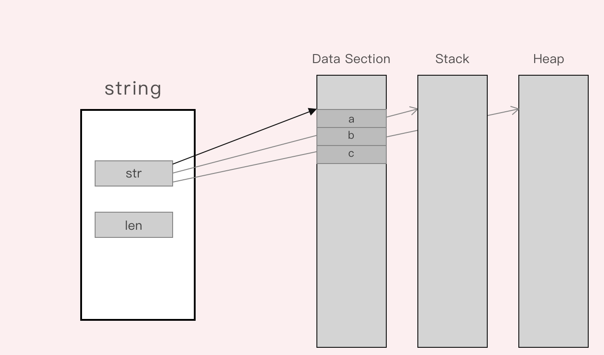

# string未必不可修改
golang中的string作为一种内置类型，在Golang的["Language Specification"](http://docs.golang.org/ref/spec)
是这样描述的：

> ##String types
> A string type represents the set of string values. A string value is a (possibly empty) sequence of bytes. 
> The number of bytes is called the length of the string and is never negative. Strings are immutable: 
> once created, it is impossible to change the contents of a string. The predeclared string type is string;
> it is a defined type.

如Spec所述，string对象是不可修改的，所以我这里的标题严格来说是错误的。

但是为何要其这样一个标题呢？当然是有点标题党的意思，初衷呢还是想从Golang中的string的本质入手，详细介绍string对象。

string的结构如下：

string的本质是一个包含"void *"指向的内存地址和一个表示字符串长度"int"的struct,如果这个内存指向的是SRODATA只读数据段
则，此时无论什么办法都无法修改这段内存中的内容，而如果这内存地址指向的是一段可以修改的普通内存地址，则可以通过本文中的方法
进行修改，而且不会消耗多余的内存。

## 1. string类型

## 2. runtime中的string

## 3. 存储string的内存

## 总结
string的本质是一个包含"void *"指向的内存地址和一个表示字符串长度"int"的struct。所谓string是不可以修改，是从string是
个内置数据类型，没有提供修改操作的层面来表达，或者说是从语言设计层面进行的一个约束。而这里提供的方法则可以认为是一种奇技淫巧。
从string的实现出发，反推出修改保存string内容也就是Spec中的"A string value is a (possibly empty) sequence of bytes"
byte数组的内容。

## 引用
1. [Strings in Golang](https://www.geeksforgeeks.org/strings-in-golang/)
2. [Language Specification](http://docs.golang.org/ref/spec)
3. [src:src/runtime/string.go](https://github.com/golang/go/blob/master/src/runtime/string.go)