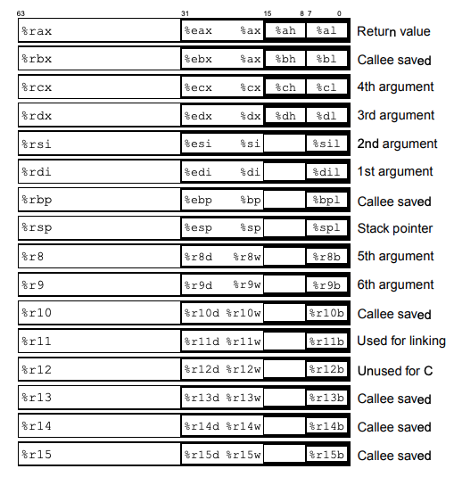
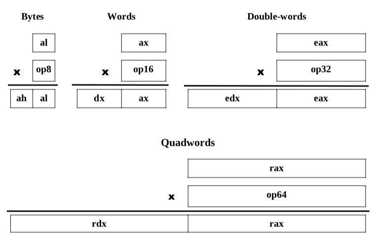
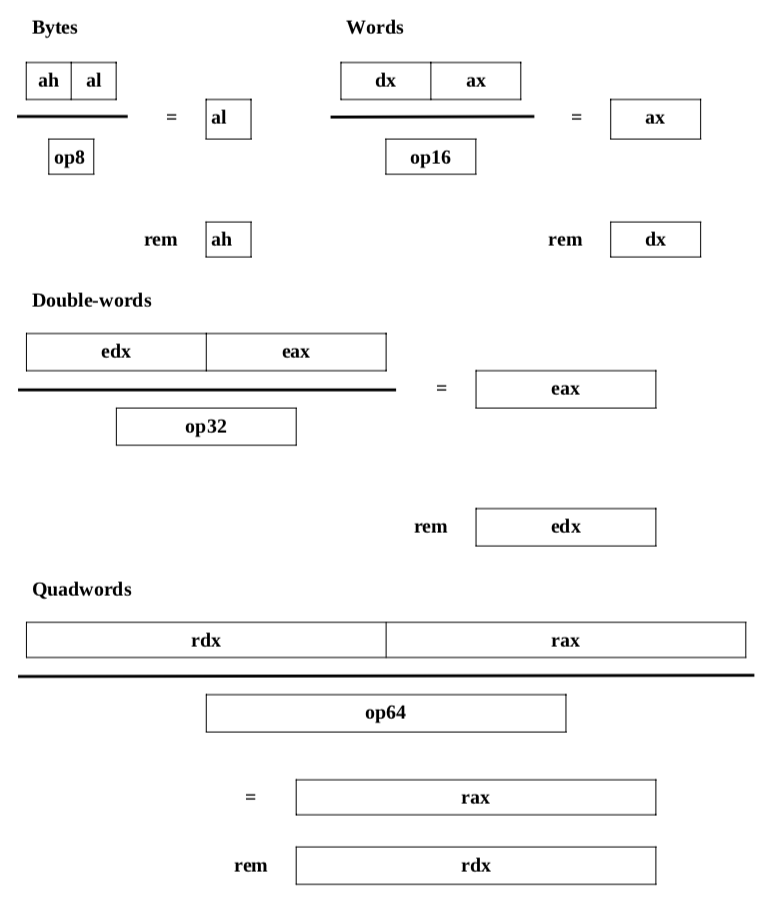
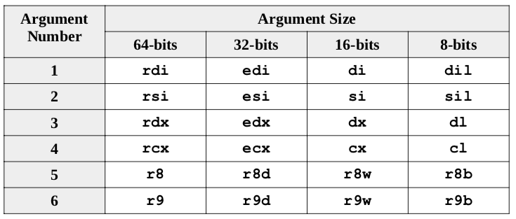
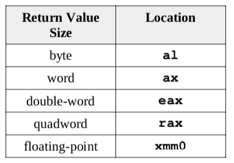

# AMD64 汇编

## 寄存器

### 通用寄存器

|寄存器|用途|
| --- | --- | 
|rax| 存放返回值|
|rdi| 第一个参数|
|rsi| 第二个参数|
|rdx| 第三个参数|
|rcx| 第四个参数|
|r8| 第五个参数|
|r9| 第六个参数|
|rbx| 局部变量|
|rbp| 局部变量|
|rsp| 栈顶|
|r10| 备用|
|r11| 备用|
|r12| 局部变量|
|r13| 局部变量|
|r14| 局部变量|
|r15| 局部变量|
|||

### 特殊寄存器
* rip : 指令指针
* eflags ： flag寄存器

## 指令集

### 内存操作

#### 1. MOV

MOV <src> <dest> 

将数据从src拷贝到dest。要求两个参数不可以同时为内存地址，切dest不能为立即数。

同时演化出类型转换

MOVZX <src> <dest> 其中dest为目标寄存器，src为比dest规格小的内存地址寻址或寄存器。

MOVZXB al, dx  将al中的内容copy到dx中，其中dl=al而dh=0。

类似的还有

MOVSX <src> <dest> 和MOVZX类似，但是是带符号的。而MOVSXD则可以处理32到64bit转换。

关于转换的几个特殊操作：

|指令|含义|
|---|---|
|CBW|将al转成ax|
|CWD|将ax转成dx:ax|
|CWDE|将ax转成eax|
|CDQ|将eax转成edx:eax|
|CDQE|将eax转成rax|
|CQO|将rax转成rdx:rax|
|||

#### 2. LEA

LEA <reg64> <mem>

将<mem>的内存地址存入到reg64寄存器中。

### 算数和位操作

#### 加法

ADD <src> <dest> 表示 dest=src+dest

INC <operand>  表示<operand>自增1

ADC <src> <dest> 表示带进位的加法，其中 dest = dest+src+carryBit(rFlag寄存器)

#### 减法

SUB <src> <dest> 表示 dest=dest-src

DEC <operand> 表示operand自减1

#### 乘法

MUL <src> 详细操作

IMUL <source> 等同MUL但是会带符号
IMUL <src/imm>,<dest> 表示 dest=dest*src/imm
IMUL <src>, <imm>, <dest> 表示dest=src*imm 切带符号

### 除法

DIV <src> 详细操作

IDEV <src> 等同DIV但是带符号

### 逻辑操作

AND  <src> <dest> 表示 dest=dest & src
OR <src> <dest>  表示 dest=dest | src
XOR <src> <dest> 表示 dest= dest ^ src
NOT <op> 表示 !op

#### 移位操作
SHL <imm>/cl <dest> 表示dest左移，需要用立即数或者cl寄存器
SHR <imm>/cl <dest> 表示dest右移，需要用立即数或者cl寄存器
SAL <imm>/cl <dest> 表示dest算术左移，需要用立即数或者cl寄存器
SAR <imm>/cl <dest> 表示dest算术右移，需要用立即数或者cl寄存器

### 控制操作

CMP <op1> <op2> 比较op1和op2并将结果存于rFlag寄存器

JMP <label> 直接跳转到对应的Lable处

|JMP| 解释|
|---|---|
|JE <label>| if <op1> == <op2>|
|JNE <label>| if <op1> != <op2>|
|JL <label>| signed, if <op1> < <op2>|
|JLE <label>| signed, if <op1> <= <op2>|
|JG <label> | signed, if <op1> > <op2>|
|JGE <label> | signed; if <op1> >= <op2>|
|JB <label> | unsigned, if <op1> < <op2>|
|JBE <label> | unsigned, if <op1> <= <op2>|
|JA <label>| unsigned, if <op1> > <op2>|
|JAE <label>|unsigned, if <op1> >= <op2>|

LOOP <label> 循环指令,如果rcx自减1，然后判断rcx为0,则继续循环，其效果等同于

    DEC %rcx
    CMP %rcx, 0
    JNE <label>

CALL <funcName> 表示调用某个函数
RET 表示从函数里面返回
调用时，参数传递为：

返回值在：

### 堆栈操作

PUSH <op64>
POP <op64>

分别表示压栈和出栈,同时会引起rsp-8（压栈）和rsp+8的操作。

## 寻址方式

|例子|意义|
|---|---|
|movl $1, 0x604892         | 操作常量表示的内存地址 |
|movl $1, (%rax)           | 操作的内存地址在寄存器中 |
|movl $1, -24(%rbp)        | 寄存器偏址 (address = base %rbp + displacement -24) |
|movl $1, 8(%rsp, %rdi, 4) | 寄存器偏址 (address = base %rsp + displ 8 + index %rdi * scale 4) |
|movl $1, (%rax, %rcx, 8)  | 寄存器偏址，偏移0 (special case scaled-index, displ assumed 0)|
|movl $1, 0x8(, %rdx, 4)   | 寄存器偏址，相对位置位0 (special case scaled-index, base assumed 0)|
|movl $1, 0x4(%rax, %rcx)  | 寄存器偏址，单位默认为1 (special case scaled-index, scale assumed 1)| 

### 立即数寻址

直接书写立即数，取其字面意义，比如AT&T写法中的

    %10 ;就是表示数字10

格式：

    $val
    常量值

### 寄存器寻址

将数字内容放入到寄存器中

格式：

    mov %rax, dst

    %R: R表示寄存器，内容在寄存器中

### 直接寻址

所谓直接寻址，就是用数字产量表示内存地址，从该地址所指向的内存中取值

格式：
    mov 0x4033d0d0, dst

    0xaddr: addr为具体的内存地址，表示将从这个内存地址处取值

### 间接寻址

间接寻址，就是将内存地址放入寄存器中，先从寄存器中取得内存地址，在从该值表示的内存地址中取内容

格式：

    mov (%rax), dst

    (%R) : R表示寄存器，读取寄存器R中的内容值，作为内存地址，再从该内存地址处读取目标内容

### 带偏移的间接寻址

在上面间接寻址的基础上，如果再加上偏移量，就是带偏移的间接寻址。典型情况比如char *字符串操作，第一个
字符为(%R)(R里面存储了字符串的地址),第二个元素可能就是(%R)+1

格式：

    mov 8(%rax), dst

    D(%R) : R表示寄存器，D表示编译量，从R里面取出的值为地址值，同时在此基础上再偏移D个字节

### 带步进的间接寻址

上面说到带偏移，主要用于已知地址后，偏移固定量。那如果是数组这种情况呢？比如int32的数组，第二个
和第一个元素地址相差为4字节。为此，引入了步进概念，步进的单位乘以数目，比如int32是4个字节，间隔
一个元素就乘以1，间隔两个元素就乘以2偏移8个字节

格式：

    mov 8(%rsp, %rcx, 4), dst

    D(%RB, %RI, S): RB为base寄存器，其内的值，表示一段内存的起始地址。RI为步进的长度，比如
    上面说的int32为4个字节，S表示步进数目，偏移1个单位就是1，如果不写的话，默认为1.D表示在
    此基础上，再偏移的量,比如上面的数组，就设置8为0，为0时，可以不写.

## 参考
* [x64 Cheat Sheet](https://cs.brown.edu/courses/cs033/docs/guides/x64_cheatsheet.pdf)
* [x86-64 Machine-Level Programming](https://www.cs.cmu.edu/~fp/courses/15213-s07/misc/asm64-handout.pdf)
* [x86-64 Assembler](https://www.cs.oberlin.edu/~bob/cs331/Class%20Notes/March/March%2014/x86-64%20Assembler.pdf)
* [CS107:Guide to x86-64](https://web.stanford.edu/class/archive/cs/cs107/cs107.1194/guide/x86-64.html)
* [CS107:One Page of x86-64](https://web.stanford.edu/class/archive/cs/cs107/cs107.1194/resources/onepage_x86-64.pdf)
* [x86-64 Assembly Language Programming with Ubuntu.pdf]