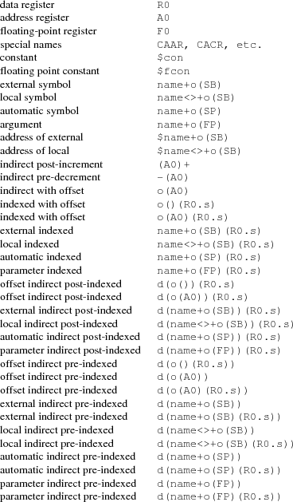

# Assembly相关

## Plan9汇编
所有汇编符号用大写。

### 寄存器

数据寄存器为R0-R7。地址寄存器A0-A7。浮点寄存器F0-F7。

有几个特殊的伪寄存器：

* FP
* SP
* TOS
* PC ： 指令计数器，针对指令个数，不是字节数
* SB ： 该进程的内存的起始地址

### 寻址模式

所有的数据引用都是相对于上面的伪寄存器的。

下列的o表示offset一个整数表示的偏移。如果o为0时，可以省略。
d表示displacement，取值为-128-127。
而.s表示size，由L/W和*1/*2/*4/*8组成

#### 寄存器寻址
* 数据寄存器 ：R0
* 地址寄存器 : A0
* 浮点寄存器 : F0
* 特殊寄存器 ： CAAR

#### 立即数寻址
* 整数 ： $123
* 浮点数 ： $1.23

### 符号 (如变量名)
* 外部符号 ： name+o(SB) 
* 局部符号 ： name<>+o(SB)
* 自动符号 ： name+o(SP)

#### 参数
name+o(FP)

#### 地址
* 外部地址 ： $name+o(SB)
* 局部地址 ： $name<>+o(SB)

#### 间接引用
* o(A0)
* o()(R0.s)
* o(A0)(R0.s)

* name+o(SB)(R0.s)
* name<>+o(SB)(R0.s)
* name+o(SP)(R0.s)
* name+o(FP)(R0.s)

### 指令

#### 存储数据
##### 将数据放入指令流

    LONG $123

* BYTE 
* LONG 
* WORD 

##### 数据段操作
使用DATA和GLOBAL组合来声明数据段的常量，比如字符串"abc"

        DATA    array+0(SB)/1, $’a’
        DATA    array+1(SB)/1, $’b’
        DATA    array+2(SB)/1, $’c’
        GLOBL   array(SB), $4

    or

        DATA    array+0(SB)/4, $"abc\z"
        GLOBL   array(SB), $4

格式为：

    DATA dest/s, value

dest表示要存放的位置，按照寻址的方式并通过"/s"指定大小。value表示要存入的值。

通过GLOBAL进行声明。

### 函数
用TEXT来进行定义，后面是函数名（带SB），然后跟着是栈大小。如：

    TEXT    sum(SB), $0
        MOVL    arg1+0(FP), R0
        ADDL    arg2+4(FP), R0
        RTS

## AT&T语法

基本格式：

    mnemonic	source, destination

和INTEL相反，把左边的数操作到右边去。

### 寄存器
所有的寄存器前面用"%"前缀

### 立即数
所有立即数用"$"前缀

### 寻址

格式：

    segment-override:signed-offset(base,index,scale)

对比：

|GAS memory operand		|	NASM memory operand||
|------------------		|	-------------------|---|
| 100					| [100]                 | |
| %es:100		        | [es:100]              | |
| (%eax)				| [eax]                 | |
| (%eax,%ebx)           | [eax+ebx]             | |
| (%ecx,%ebx,2)			| [ecx+ebx*2]           | |
| (,%ebx,2)				| [ebx*2]               | |
| -10(%eax)				| [eax-10]              | |
| %ds:-10(%ebp)			| [ds:ebp-10]           | |

### 操作单位

在mnemonic后面缀"b"/"w"/"l" 分别表示byte、word、double word。

    movl	$100, %ebx
    pushl	%eax
    popw	%ax

### 控制指令

    GAS syntax			NASM syntax
    ==========			===========

    jmp	*100			jmp  near [100]
    call	*100			call near [100]
    jmp	*%eax			jmp  near eax
    jmp	*%ecx			call near ecx
    jmp	*(%eax)			jmp  near [eax]
    call	*(%ebx)			call near [ebx]
    ljmp	*100			jmp  far  [100]
    lcall	*100			call far  [100]
    ljmp	*(%eax)			jmp  far  [eax]
    lcall	*(%ebx)			call far  [ebx]
    ret				retn
    lret				retf
    lret $0x100			retf 0x100

## X86_64汇编

### 指令

### 寄存器

### 寻址模式

### 函数调用

## Golang汇编

## 参考
* [A Manual for the Plan 9 assembler](https://9p.io/sys/doc/asm.html)
* [How to Use the Plan 9 C Compiler.pdf]
* [Plan 9 C Compilers](https://9p.io/sys/doc/compiler.html)
* [AT&T Assembly Syntax](https://csiflabs.cs.ucdavis.edu/~ssdavis/50/att-syntax.htm)
* [A Quick Guide to Go's Assembler](https://golang.org/doc/asm)
* [Linux assemblers: A comparison of GAS and NASM](https://web.archive.org/web/20131003180256/http://www.ibm.com/developerworks/linux/library/l-gas-nasm/index.html)