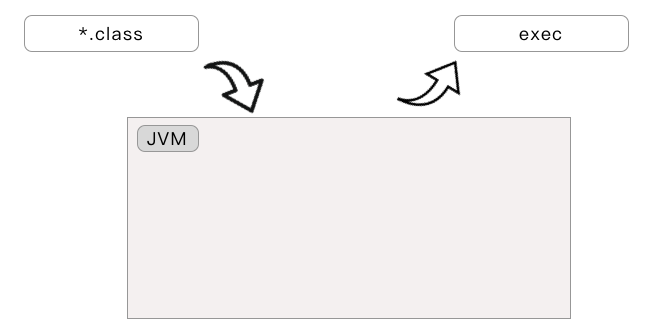

# Go生成的二进制文件
当执行`go build`的时候，go会根据需要，索引当前需要的源文件，并执行编译连接操作，产生可以执行的二进制文件，
在linux平台上生成的是可执行的elf文件，而Mac上则是Mac-O文件，对应的Windows平台是PE文件格式。

那么go在编译一个"hello world"的.go文件的时候，仅仅只编译了这个文件里面的几行文件么？

## 二进组成

但凡引入了GC机制，一般认为多多少少都对性能会有影响，可以认为运行了个管理器在那边，随时可能会影响到我们应用逻辑
的执行，而这种管理有两种主要形式，一个是运行一个虚拟机类进行管理比如Java/Python/Lua,一个是将运行时编入到二进制中
比如Objective-C。其实还有一种是在编译器里面进行优化,生成代码编入二进制,本质也属于第二类，比如Rust。

类似Java、Scala、Python这类语言，代码有个中间语言，比如JVM的字节码、Python的字节码pyc文件等。
其执行过程是先启动一个虚拟机，然后在用虚拟机去执行中间结果字节码：

Go没有类似Java/Python的虚拟机，而是和OC类似，每个可执行文件中 编译进去了一个runtime库，这个runtime
包含了GC内存管理、Groutine调度、系统调用等等功能。并且由于runtime的存在，一个Go编译的可执行文件，其甚至不依赖
libc库。Go编译的可执行文件可以认为由着几个部分组成：

## HelloWorld 可执行文件
既然Go的可执行文件是单独的，不依赖与运行时，那么其组成是怎样的呢？和一个传统的C程序相比有什么区别？

来看分别用两个语言实现的hello world：

    C

    #include <stdio.h>

    int main(int argc, char *argv[]) 
    {
            printf("hello world \n");
            return 0;
    }

    [root@centos ~/tmp/c]# ls -al
    total 840
    drwxr-xr-x 2 root root   4096 Apr 28 14:44 .
    drwxr-xr-x 3 root root   4096 Apr 28 13:11 ..
    -rwxr-xr-x 1 root root 844063 Apr 28 13:12 a.out
    -rw-r--r-- 1 root root     89 Apr 28 13:12 main.c

在来看一个Go的：

    Go

    package main

    func main() {
        println("hello world")
    }

    [root@centos bootstarp]# ls -al
    total 5644
    drwxr-xr-x 2 root root    4096 Apr 28 14:45 .
    drwxr-xr-x 4 root root    4096 Apr 28 13:16 ..
    -rwxr-xr-x 1 root root 1148861 Apr 28 14:45 bootstarp
    -rw-r--r-- 1 root root      57 Apr 28 14:45 main.go

上面的执行环节是ubuntu 16.04 LTS amd64 架构。可以看到使用C进行静态编译的二进制文件大小为884KB，而Go的静态编译
的可执行文件大小为1148KB，多了264KB。

那么Go在编译的过程中出了这个main.go还编译进去了哪些文件呢？

可以通过两种方式来确定， 一个是使用汇编，汇编直接会将编译的函数都用TEXT标签标示出来。

首先进行汇编：

    go tool objdump bootstarp > bootstrap.asm

然后对汇编结果进行过滤：

    cat bootstrap.asm |grep TEXT |grep "/home/cz" | awk '{print $3}' | sort | uniq

    /home/cz/go/src/internal/bytealg/compare_amd64.s
    /home/cz/go/src/internal/bytealg/equal_amd64.s
    /home/cz/go/src/internal/bytealg/index_amd64.go
    /home/cz/go/src/internal/bytealg/indexbyte_amd64.s
    ...
    /home/cz/go/src/runtime/timestub.go
    /home/cz/go/src/runtime/trace.go
    /home/cz/go/src/runtime/traceback.go
    /home/cz/go/src/runtime/type.go
    /home/cz/go/src/runtime/vdso_linux.go
    /home/cz/go_proj/src/localhost/test/bootstarp/main.go

加上main.go，总共大概80个文件，包含了原本的汇编文件和runtime的go实现文件。

真的就是这些文件么？

那肯定，汇编结果肯定就是最终编译进去的符号了。但是呢？实际上的文件还会跟多，因为有些文件可能没有具体的函数实现
而有的实现因为没有使用可能没有编译进去。

这个时候就要根据前面的《使用go编译go》中诉说的，我们自己重新编译下go的编译toolchain，然后在使用文件的位置进行日志打印

首先找到gc编译器的代码，go/src/cmd/compile/internal/gc/noder.go:

    func parseFiles(filenames []string) uint {
        var noders []*noder
        // Limit the number of simultaneously open files.
        sem := make(chan struct{}, runtime.GOMAXPROCS(0)+10)

        for _, filename := range filenames {
            p := &noder{
                basemap: make(map[*syntax.PosBase]*src.PosBase),
                err:     make(chan syntax.Error),
            }
            noders = append(noders, p)

            go func(filename string) {
                sem <- struct{}{}
                defer func() { <-sem }()
                defer close(p.err)
                base := syntax.NewFileBase(filename)
                println("CZ compile.gc.noder.parseFile:", filename) // 增加这行

                ...

增加一行日志打印。然后找到汇编器asm的代码， go/src/cmd/asm/internal/lex/lex.go:

    func NewLexer(name string) TokenReader {
        input := NewInput(name)
        println("CZ asm.lex.NewLexer:", name) // 增加这行
        ...

和 go/src/cmd/asm/internal/lex/input.go:

    func (in *Input) include() {
        // Find and parse string.
        tok := in.Stack.Next()
        if tok != scanner.String {
            in.expectText("expected string after #include")
        }
        name, err := strconv.Unquote(in.Stack.Text())
        if err != nil {
            in.Error("unquoting include file name: ", err)
        }
        in.expectNewline("#include")
        // Push tokenizer for file onto stack.
        println("CZ asm.input.include:", name) // 增加这行
        ...

也各增加一行日志.

这样使用上面修改代码重新构建go,然后再用这个新的go编译toolchain来编译bootstrap（编译过程参考：使用go编译go）

会看到：

    # runtime/internal/sys
    CZ compile.gc.noder.parseFile: ../../../../../gosrc/go/src/runtime/internal/sys/zversion.go
    CZ compile.gc.noder.parseFile: ../../../../../gosrc/go/src/runtime/internal/sys/arch.go
    CZ compile.gc.noder.parseFile: ../../../../../gosrc/go/src/runtime/internal/sys/stubs.go
    ...

    # runtime
    CZ asm.lex.NewLexer: ../../../../../gosrc/go/src/runtime/asm.s
    CZ asm.input.include: textflag.h
    # runtime
    CZ asm.lex.NewLexer: ../../../../../gosrc/go/src/runtime/asm_amd64.s
    CZ asm.input.include: go_asm.h
    CZ asm.input.include2: ../../../../../gosrc/go/src/runtime/go_asm.h
    ...
    # bootstrap
    CZ compile.gc.noder.parseFile: $WORK/b001/_gomod_.go
    CZ compile.gc.noder.parseFile: ./main.go

这里就列出了所有使用到的文件了。

## 引导进main.main
那么编译了这么多的文件，Go的可执行文件是如何进入到main.go的`main()`函数的呢？

## 总结
Go采用了和OC类似的，将runtime和业务代码都同级别的编译成相应的机器码可执行代码。在编译期间，除了会编译业务代码，还会
将"go/src/runtime"中的代码编译进可执行文件中。可执行文件执行时，首先会初始化runtime,然后开启一个新的Goroutine来
运行业务逻辑代码中的main.main函数。因为runtime是在编译期间同时引用代码的，所以想了解runtime的特性，可以直接在GO的
安装包里面修改runtime代码，然后构建执行来看差别

## 引用
1. 
2. [使用go编译go]()
