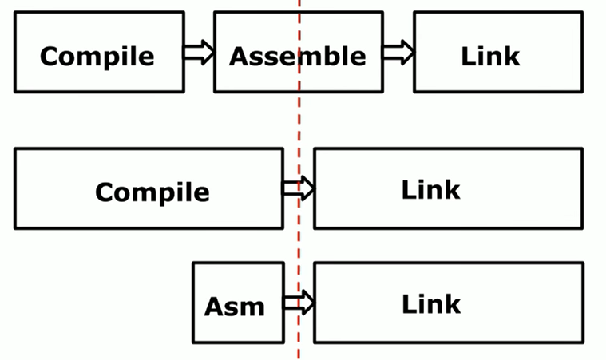

# 使用go编译go
Go从1.4之后，开始实现自举，也就是可以自己编译自己，具体是什么意思呢？通俗的来说就是Go的编译逻辑都切换成Go来写的了
并且可以通过之前的版本的Go（>=Go1.4)来构建出Go的编译工具链， 打开一个编译好二进制的go的发布包，比如
[1.13.5](https://dl.google.com/go/go1.13.5.darwin-amd64.tar.gz) 解压后会看到go/bin目录为：

    tree bin
    bin
    ├── go
    └── gofmt

里面是两个常用的命令`go` 和`gofmt`。

另外一个目录是go/pkg/tool：

    tree pkg/tool
    └── darwin_amd64
        ├── addr2line
        ├── asm
        ├── buildid
        ├── cgo
        ├── compile
        ├── cover
        ├── dist
        ├── doc
        ├── fix
        ├── link
        ├── nm
        ├── objdump
        ├── pack
        ├── pprof
        ├── test2json
        ├── trace
        └── vet

这里可以看到一系列的 `go tool xxx` 的子命令。而其中在上面列出的"asm"、"cgo"、"compile"、"link" 则构成了
go编译的工具链"toolchain",类似组合成gcc命令集中的 "as","gcc","ld" 

|go|gcc|功能|
|---|---|---|
|asm|as| 汇编器|
|compile/cgo|gcc| C/Go编译器|
|link|ld| 连接器|

其中cgo是专门处理go和c混编的。

## 编译工具链
在Rob Pike设计Go的汇编的[GopherCon 2016: Rob Pike - The Design of the Go Assembler](https://www.youtube.com/watch?v=KINIAgRpkDA)演讲中，说到了一个语言的构建工具toolchain一般的结构：

是包含着三个部分：

* 编译器
* 汇编器
* 连接器

这也是计算机专业学生的编译原理课上提到的内容。书上会说：

> 编译器生成汇编语言，然后在将汇编编译成目标文件,最后通过连接器进行连接生成二进制文件

所以要构建go，我们就是要构建go的编译器（gc): cmd/compile 汇编器：cmd/asm 以及连接器：cmd/link。

## Go自举过程

编译Go可以参考官方的文档[Installing Go from source](https://golang.org/doc/install/source)。文档中
说的比较多，因为考虑到历史原因，而在当前9102年了，相信大家都已经可以很方便的安装一个可运行的go环境，所以安装go
就可以简单的用一句话来概括：

    下载源码，然后执行src目录下all.bash脚本

真的就这么简单。

首先下载文件：
    mkdir gosrc
    cd gosrc
    wget -c  https://dl.google.com/go/go1.13.5.darwin-amd64.tar.gz
    tar zxvf go1.13.5.darwin-amd64.tar.gz

没有科学上网的可以考虑下[studygolang](https://studygolang.com/)。

这里假设下载到了 ~/gosrc/ 目录下，解压后得到go目录。

然后进入到"go/src/" 目录，修改下all.bash文件：

    #!/usr/bin/env bash
    # Copyright 2009 The Go Authors. All rights reserved.
    # Use of this source code is governed by a BSD-style
    # license that can be found in the LICENSE file.

    set -e
    if [ ! -f make.bash ]; then
        echo 'all.bash must be run from $GOROOT/src' 1>&2
        exit 1
    fi
    OLDPATH="$PATH"
    . ./make.bash "$@" --no-banner
    #bash run.bash --no-rebuild
    PATH="$OLDPATH"
    $GOTOOLDIR/dist banner  # print build info

注释掉 `bash run.bash --no-rebuild` 这个主要是跑自动化测试，可以省去这个时间。

    ./all.bash
    Building Go cmd/dist using /Users/you/go.
    Building Go toolchain1 using /Users/you/go.
    Building Go bootstrap cmd/go (go_bootstrap) using Go toolchain1.
    Building Go toolchain2 using go_bootstrap and Go toolchain1.
    Building Go toolchain3 using go_bootstrap and Go toolchain2.
    Building packages and commands for darwin/amd64.
    ---
    Installed Go for darwin/amd64 in /Users/you/gosrc/go
    Installed commands in /Users/you/gosrc/go/bin
    *** You need to add /Users/you/gosrc/go/bin to your PATH.

表示构建成功，在"/Users/you/gosrc/go/bin"目录就可以看到构建好的go和gofmt工具了。同时在"/Users/you/gosrc/go/pkg/tool"目录下还可以看到"go tool" 的子工具。

那么这个all.bash脚本具体干了什么事情呢？实际上，其仅仅是调用了make.bash。而make.bash里面则实际上执行了：

    ...
    GOROOT="$GOROOT_BOOTSTRAP" GOOS="" GOARCH="" GO111MODULE=off "$GOROOT_BOOTSTRAP/bin/go" build -o cmd/dist/dist ./cmd/dis
    ...
    ./cmd/dist/dist bootstrap $buildall $vflag $GO_DISTFLAGS "$@

逻辑上就是先用现有的go来构建"cmd/dist/dist" ，然后在执行 "./cmd/dist/dist bootstrap"

前者比较容易理解，就和一个普通的go程序一样，使用的是你机器上原本安装好的go来构建的，要求版本>=1.4。实际上
这里的原理是将一些脚本通过go来实现了，这样减少了针对不同的平台编写复杂的构建脚本的问题。这里的dist就相当于是go
的构建脚本。

dist的入口在go/src/cmd/dist/main.go中，一个完整的可执行程序，那么来看下这个脚本执行 bootstrap 时干了什么。

当传入boostrap参数时，调用了`cmdbootstrap`方法，来看go/src/cmd/dist/build.go文件：

    // The bootstrap command runs a build from scratch,
    // stopping at having installed the go_bootstrap command.
    //
    // WARNING: This command runs after cmd/dist is built with Go 1.4.
    // It rebuilds and installs cmd/dist with the new toolchain, so other
    // commands (like "go tool dist test" in run.bash) can rely on bug fixes
    // made since Go 1.4, but this function cannot. In particular, the uses
    // of os/exec in this function cannot assume that
    //	cmd.Env = append(os.Environ(), "X=Y")
    // sets $X to Y in the command's environment. That guarantee was
    // added after Go 1.4, and in fact in Go 1.4 it was typically the opposite:
    // if $X was already present in os.Environ(), most systems preferred
    // that setting, not the new one.
    func cmdbootstrap() 

这里看关键代码，首先定义了toolchain的组成：

    var toolchain = []string{"cmd/asm", "cmd/cgo", "cmd/compile", "cmd/link"}

然后构建toolchain,在 go/src/cmd/dist/buildtoo.go中：

    func bootstrapBuildTools() {
        ...
        cmd := []string{
            pathf("%s/bin/go", goroot_bootstrap),
            "install",
            "-gcflags=-l",
            "-tags=math_big_pure_go compiler_bootstrap",
        }
        if vflag > 0 {
            cmd = append(cmd, "-v")
        }
        if tool := os.Getenv("GOBOOTSTRAP_TOOLEXEC"); tool != "" {
            cmd = append(cmd, "-toolexec="+tool)
        }
        cmd = append(cmd, "bootstrap/cmd/...")
        ...

实际上就是 ：

    go install cmd/asm
    go install cmd/cgo
    go install cmd/compile
    go install cmd/link

## 使用自己构建的go

现在我们来修改下工具链的代码，首先找到gc编译器的代码，go/src/cmd/compile/internal/gc/noder.go:

    func parseFiles(filenames []string) uint {
        var noders []*noder
        // Limit the number of simultaneously open files.
        sem := make(chan struct{}, runtime.GOMAXPROCS(0)+10)

        for _, filename := range filenames {
            p := &noder{
                basemap: make(map[*syntax.PosBase]*src.PosBase),
                err:     make(chan syntax.Error),
            }
            noders = append(noders, p)

            go func(filename string) {
                sem <- struct{}{}
                defer func() { <-sem }()
                defer close(p.err)
                base := syntax.NewFileBase(filename)
                println("CZ compile.gc.noder.parseFile:", filename) // 增加这行

                ...

增加一行日志打印。然后找到汇编器asm的代码， go/src/cmd/asm/internal/lex/lex.go:

    func NewLexer(name string) TokenReader {
        input := NewInput(name)
        println("CZ asm.lex.NewLexer:", name) // 增加这行
        ...

和 go/src/cmd/asm/internal/lex/input.go:

    func (in *Input) include() {
        // Find and parse string.
        tok := in.Stack.Next()
        if tok != scanner.String {
            in.expectText("expected string after #include")
        }
        name, err := strconv.Unquote(in.Stack.Text())
        if err != nil {
            in.Error("unquoting include file name: ", err)
        }
        in.expectNewline("#include")
        // Push tokenizer for file onto stack.
        println("CZ asm.input.include:", name) // 增加这行
        ...

也各增加一行日志.

然后回到上面，执行`all.bash` 编译go的编译toolchain。 这次会有很多日志输出，不用管，是上面代码的影响。

接着写个不做任何逻辑的go程序， main.go:

    package main

    func main() { }

执行编译：

    GOROOT=/Users/you/gosrc/go/ /Users/you//gosrc/go/bin/go build  -a  

这样使用上面刚刚构建好的新的go来进行构建

会看到：

    # runtime/internal/sys
    CZ compile.gc.noder.parseFile: ../../../../../gosrc/go/src/runtime/internal/sys/zversion.go
    CZ compile.gc.noder.parseFile: ../../../../../gosrc/go/src/runtime/internal/sys/arch.go
    CZ compile.gc.noder.parseFile: ../../../../../gosrc/go/src/runtime/internal/sys/stubs.go
    ...

    # runtime
    CZ asm.lex.NewLexer: ../../../../../gosrc/go/src/runtime/asm.s
    CZ asm.input.include: textflag.h
    # runtime
    CZ asm.lex.NewLexer: ../../../../../gosrc/go/src/runtime/asm_amd64.s
    CZ asm.input.include: go_asm.h
    CZ asm.input.include2: ../../../../../gosrc/go/src/runtime/go_asm.h
    ...
    # bootstrap
    CZ compile.gc.noder.parseFile: $WORK/b001/_gomod_.go
    CZ compile.gc.noder.parseFile: ./main.go

等的打印，这些就是在构建main.go的时候，真实编译进可执行二进制文件中的内容，其中主要是go的runtime实现，包含了
go代码以及汇编代码。可以看到：

    ls -al
    drwxr-xr-x  9 you Users      288 Apr 27 20:01 .
    drwxr-xr-x  4 you Users      128 Apr 23 19:12 ..
    -rwxr-xr-x  1 you Users  1123128 Apr 27 19:57 bootstrap

一个没有任何逻辑的main函数编译出来居然有1.1MB大小，原因是go的runtime编译进去了。

## 总结
一个语言的构建工具，或者叫toolchain，对于静态语言来说一般包含了编译器、汇编器以及连接器。而go通过用go来重现
实现go的这套工具链，不仅是意义上的自举，同时还重现实现了其自己的汇编语言编译过程,不用再依赖plan9时代的8a/8c/
6a/6c (8意思是386cpu,6意思是amd64 cpu, a表示asm汇编器，c表示compile编译器)

如果想要学习go的编译过程，就从"src/cmd/compile" "src/cmd/asm" "src/cmd/link"这些代码入手即可。

## 参考
1. [Installing Go from source](https://golang.org/doc/install/source)
2. [GopherCon 2016: Rob Pike - The Design of the Go Assembler](https://www.youtube.com/watch?v=KINIAgRpkDA)